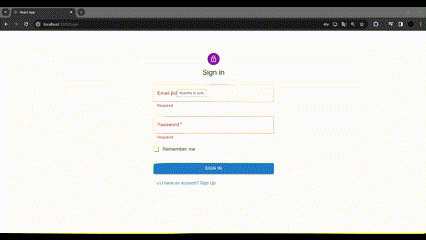
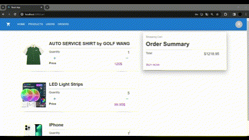
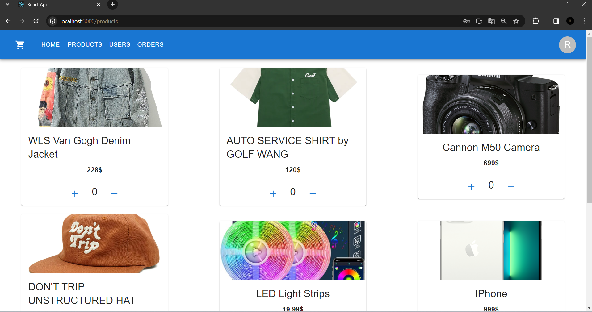
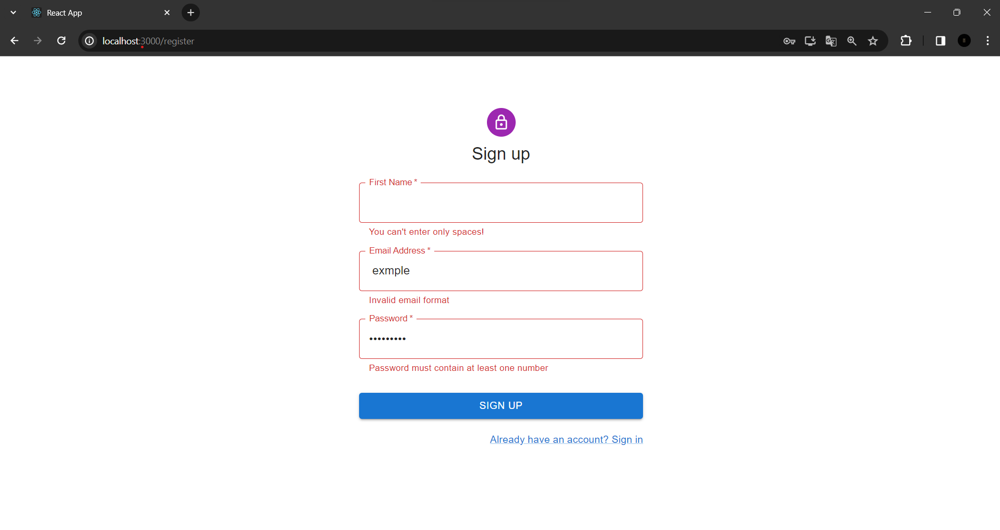
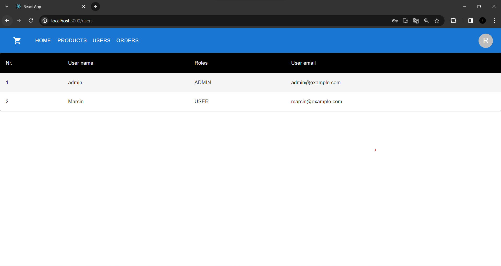
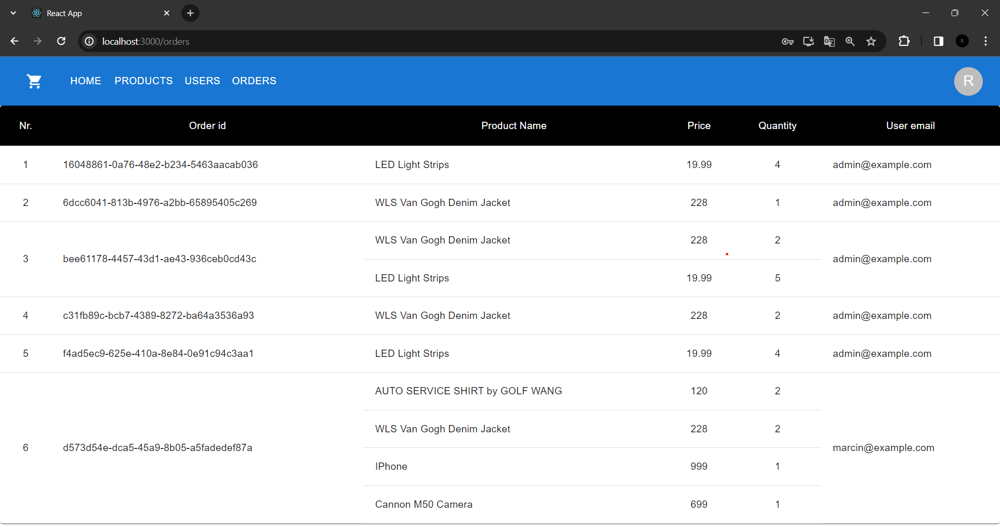
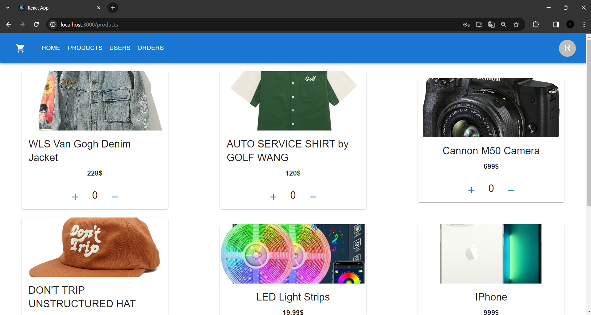
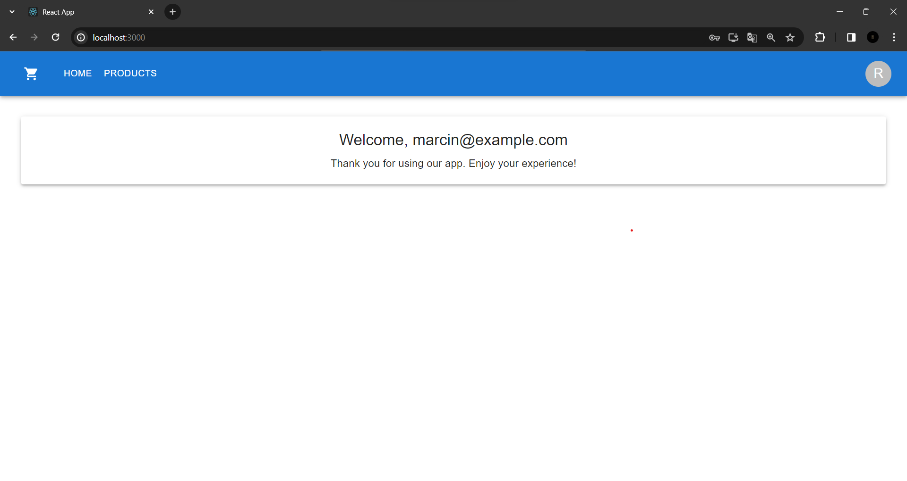

# E-commerce Paymove recruitment task

## 🌟 Project aim

The goal of this project is to create a simple e-commerce application as part of a recruitment task for Paymove. The application aims to showcase the ability to implement fundamental e-commerce functionalities and demonstrate proficiency in web development skills.
  

## 🟢 Features

  
**1. User Authentication:**
- Users can register and log in to the application.
- Authentication is implemented using JSON Web Tokens (JWT) for secure user sessions.
- Two distinct user roles exist: ADMIN and USER.
- Login and registration functionalities are covered by both unit and integration tests.

**2. E-commerce Functionality:**

- Users have the ability to browse products within the application.
- Users can place orders for selected products.
- Admin users, with the role ADMIN, possess special privileges, allowing them to view all registered users and access information about placed orders.

**3. Technology Stack:**
- Backend development is carried out using Spring Boot,Spring Security,Spring Data, MySQL
- Frontend development is implemented with React and Material-UI (MUI).

**4. Secure Communication:**
- JWT authentication ensures secure and authenticated communication between the frontend and backend components.

## 🖼️ Demo 

  Login |  Cart
:-------------------------:|:-------------------------:
  |   

Products | Registration 
:-------------------------:|:-------------------------:
  | 

Users page | Orders page
:-------------------------:|:-------------------------:
  |  

Admin view | User view
:-------------------------:|:-------------------------:
  |  
  

